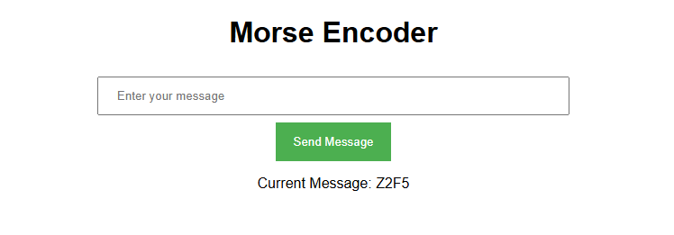

# Morse to light

Blink morse code messages from a webpage

## Setup
1. LED goes in pin 2 (with resistor)
2. Put your wifi details in here:
```
ssid = "wifi name"
password = "wifi password"
```
3. Upload to ESP32!
4. Check Serial Monitor (115200) for the IP
5. Open that IP in a browser


## If it's not working
- Skill issue probably
